***
## ラボの概要

ハイブリッド クラウドの採用の増加により、データはさまざまなクラウドやオンプレミス環境だけでなく、データ ウェアハウス、レイク、レイクハウスなどのさまざまな種類のデータ ストアにも、あらゆる場所に保存されるようになりました。API は、さまざまなデータ ソースとアプリケーション間の重要なコネクターとして機能します。これは、企業がアプリケーションやエクスペリエンスを強化するために必要なデータを取得するために、これまで以上に多くの API に依存し、作成していることを意味します。

GraphQL は、企業がデータを操作するための頼りになるクエリ言語として急速に普及し、REST API とデータ システムへの投資を重ねる API の新しい標準として浮上しています。GraphQL API はアプリケーション チームにとって非常に使いやすいものですが、その構築を担当する API プロバイダー チームにとっては課題となる可能性があります。私たちは、宣言的に構築された API の方が単純に優れていると信じています。これにより、クリーンなコード行が減り、デプロイ時間が短縮され、パフォーマンス、コスト、信頼性の最適化が組み込まれた API で最初の実装が可能になります。

宣言的にプログラミングする場合、システムを構成することになります。また、すべてのクエリにわたって、さまざまな状況に適用できる普遍的なルールをシステムに提供することになります。結果として得られるコードは耐障害性が向上し、(DRY 原則に従って) ソフトウェア パターンの繰り返しが減り、理解と保守が容易になります。重要なのは、これにより、本来なら自分でコーディングする必要がある作業をプラットフォームが実行できるようになります。

StepZen を使用すると、開発者は複数のバックエンドから必要なデータを取得する単一の GraphQL API を簡単に構築してデプロイできます。API は、バックエンド プロトコル、スキーマ、認証に関係なく、適切なデータを確実に配信します。開発者がインフラストラクチャを管理しないように API を管理します。

StepZen の宣言型アプローチを使用すると、開発者は GraphQL ビルディング ブロックを構成して GraphQL スキーマを作成することで、GraphQL API (およびフェデレーション グラフ) を構築できます。強力なイントロスペクション機能は、エンタープライズ データの GraphQL モデルをわずか数行のコードで構築および構成できることを意味します。

API を宣言的に構築するため、StepZen は API を理解し、実行時に最適化の決定を下すことができ、低レイテンシーと高スループットを実現し、バックエンドへの負担を最小限に抑えます。

API Connect を使用すると、開発者は API を簡単に管理、保護、ソーシャル化、監視できます。StepZen の前に API Connect を配置すると、GraphQL、REST、SOAP、その他の形式の API をすべて 1 つの製品に組み込んだ API 製品を簡単に構築できます。その後、独自の使用条件を持つさまざまな API プランに基づいて API 製品を販売することができます。製品とプランを設定すると、セルフサービスの開発者ポータルを使用してそれらを宣伝し、エンド ユーザーにソーシャル化することができます。これにより、顧客は、積極的に関与しなくても、API 製品を見つけて試し、支払いを行うことができます。最後に、API の使用状況を監視して、問題だけでなく傾向も把握できます。

API Connect 管理は、新しい GraphQL API と既存の REST API を統合すると同時に、新しい StepZen GraphQL API に最高クラスのセキュリティも提供します。脅威保護、レート制限、収益化はすべて、すべてのトランザクションの入力 GraphQL クエリの高度にカスタマイズされた分析に基づいて行うことができ、ユーザーによるわずかな宣言的アサーションが必要です。スキーマのどの部分がより高価であるかを API Connect に伝えると、API Connect はそれを顧客からのすべてのクエリに合わせてカスタマイズします。

このラボが終了するまでに、StepZen と API Connect を組み合わせて、異種のバックエンド (バックエンド間のリンクを含む) を単一の API に結合するための世界クラスのシステムをデプロイし、API を保護し、顧客にソーシャル化して、その呼び出しを監視しました。

始めましょう！

***

## 前提条件

IBM API Connect 環境が必要です。このラボの一環として、AWS で IBM API Connect as a Service を使用します。アカウントをお持ちでない場合は、この <a href="https://ibm-integration.github.io/learninghub/labs/trial-aws/#1-start-your-ibm-api-" の手順に従ってください。 connect-trial-on-aws" target="_blank">ドキュメント</a>を参照して、30 日間のトライアルアカウントを作成します。

StepZen アカウントが必要です。StepZen は、開発者が GraphQL API を構築する簡単な方法を提供します。StepZen は宣言型プログラミング アプローチ (HOW を明示的に指定せずに、プログラムが何を行うかを記述する) を採用しており、その結果、コードがより小さく直感的になり、実行時のパフォーマンスが向上し、価値実現までの時間が短縮されます。StepZen は柔軟性が非常に高いように設計されています。他の API アプローチと互換性があり、サービスとして (SaaS) で利用できるほか、プライベート クラウドやオンプレミス データ センターでの展開もサポートしています。アカウントをお持ちでない場合は、<a href="https://stepzen.com/signup" target="_blank">こちら</a>から無料の StepZen アカウントを作成して開始できます (クレジット カードは必要ありません)必須）。

***

## ビジネスコンテキスト

あなたの会社は、API の新しい標準として GraphQL に投資することを決定しました。GraphQL は API 用のクエリ言語であり、REST API リクエストと比較して、アプリケーション クライアントが API リクエストで取得するデータをより詳細に制御できるようになります。

あなたは、開発者があらゆる場所に保存されているデータを使用して GraphQL API を構築する簡単な方法を模索したいと考えています。電子商取引アプリケーションを例に考えてみましょう。GraphQL は、1 回の呼び出しで、顧客情報、注文番号、配送ステータスなど、さまざまなサブシステムにあるデータを結合し、期待される形式で返すことができます。GraphQL API はアプリケーション チームにとって非常に使いやすいものですが、その構築、セキュリティ保護、ソーシャル化、管理を担当する API チームにとっては課題となる可能性があります。これらの API の構築プロセスを容易にするために、データへのフェデレーション アクセスのための宣言的アプローチを使用して GraphQL API を作成する方法を検討したいと考えています。

一方、開発者は、社内での GraphQL API の使用管理に問題を抱えています。

GraphQL には、REST API に比べて次のような特別な利点があります。

  - アプリケーションクライアントは、必要なデータのみをリクエストできます。たとえば、銀行口座レコードを取得する場合は、各口座の口座番号と現在の残高のみを要求し、顧客名や住所の詳細は要求しません。REST API リクエストでは、バックエンド REST サービスがさまざまなデータ サブセットに個別のエンドポイントまたはパラメータを提供するか、アプリケーション クライアントが完全なレコードを取得して不要なデータを破棄する必要があります。

  - アプリケーションクライアントは、単一のリクエストで複数の関連リソースを取得できます。たとえば、顧客の銀行口座レコードには、顧客が保有する他の金融商品を参照する配列が含まれる場合があります。アプリケーション クライアントが特定の顧客の銀行口座の詳細と、その顧客の他の金融商品の詳細を取得したい場合、クライアントは REST API を使用してまず銀行口座の詳細を取得し、次にそれぞれの銀行口座の詳細を個別にリクエストします。他の製品。GraphQL API は、クライアントが 1 回のリクエストでこのすべての情報を取得できるように設計できます。

ただし、この柔軟性にはレート制限に関するセキュリティ上の課題が伴います。これは、一見非常によく似た 2 つのリクエストが、非常に異なる量のデータを返す可能性があり、複数の REST API リクエストが必要であったものが、それぞれがレート制限にカウントされる可能性があるため、単一の GraphQL API リクエストしか必要としない可能性があるためです。 。したがって、取得されるデータの量を反映するレート制限制御を課すことが重要です。

***

## ラボの概要

このラボでは、GraphQL ドメインでゼロからエンタープライズに移行する方法を学びます。最初に、StepZen を使用して、異なるソース (REST API と MySQL) からデータを取得してフェデレーション GraphQL API を作成する方法を学びます。その後、IBM API Connect を使用して、StepZen からバックエンド GraphQL サーバーをプロキシする GraphQL API プロキシ定義を作成し、GraphQL API へのリクエストによってサーバーから返されるデータ量を反映するレート制限制御を定義します。

このラボでは、次のセクションを完了します。

  - 1 - Node.JS をインストールする
  - 2 - IDE をインストールする
  - 3 - StepZen のセットアップ
  - 4 - REST API から GraphQL API を構築する
  - 5 - GraphQL API に新しい REST API を追加する
  - 6 - MySQL データベースから GraphQL スキーマを自動生成する
  - 7 - @materializer を使用したビルディング ブロックのコンポジションの作成
  - 8 - APIC で GraphQL プロキシ API を作成する
  - 9 - GraphQL プロキシ API の編集とテスト
  - 10 - プロダクトを作成し、GraphQL RateLimits を適用する
  - 11 - 開発者ポータルから API を探索する

***

## 1 - Node.JS をインストールする

このセクションでは、Node.JS をマシンにインストールします。始めましょう！

1. ラボ環境を起動し、ブラウザを開きます。


2. <a href="https://nodejs.org" target="_blank">以下の URL</a> を開きます (1)。そして、推奨されるnode.jsバージョンをダウンロードしてください。
```
https://nodejs.org
```


3. ノードのインストールをマシンに保存し、実行します。


4. デフォルト値を受け入れ、[**インストール**] をクリックしてインストールを完了します。


5. 完了したら、[**完了**] をクリックします。

***

## 2 - IDE をインストールする

**統合開発環境 (IDE)** は、プログラムの開発、コンパイル、リンク、デバッグに必要なものがすべて含まれたソフトウェアです。さらに、IDE には通常、統合ヘルプ、名前補完、自動フォーマット、場合によってはバージョン管理システムなど、その他の便利な編集機能が多数バンドルされています。したがって、これらすべてのことを個別に実行することもできますが、IDE をインストールして、単一のインターフェイスからすべてにアクセスできるようにする方がはるかに簡単です。

このラボでは、IDE を使用して GraphQL スキーマを調査します。好みの IDE を使用してください。特に希望がない場合は、以下の手順に従って Visual Studio Code をインストールできます。

1. ブラウザで、<a href="https://code.visualstudio.com/Download" target="_blank">以下の URL</a> を開きます (1)。そして、お使いの OS に固有の VSCode ユーザー インストーラーをダウンロードします (2)。
```
https://code.visualstudio.com/Download
```
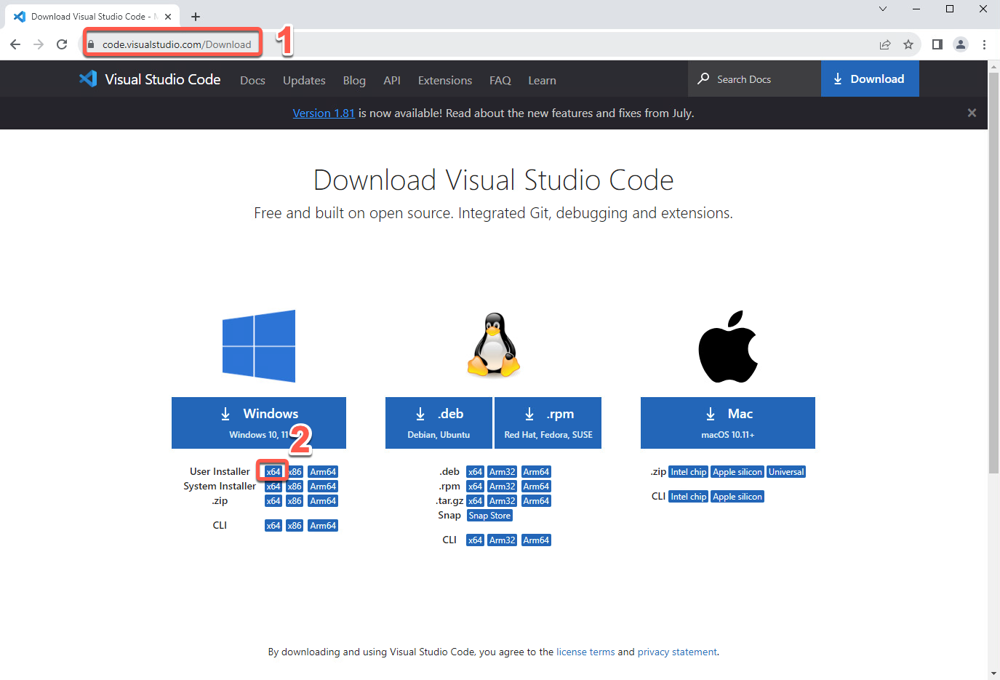

2. VSCode インストールをマシンに保存し、実行します。


3. インストール手順に従ってインストールを完了します。


4. 最後に、**Visual Studio Code を起動する** オプションをオンにして、**完了** をクリックします。


5. [**ようこそ**] タブを閉じます。


6. [**ターミナル**] メニューを開き、[**新しいターミナル**] をクリックします。


7. 素晴らしい！Visual Studio Code の下部にターミナル ウィンドウが表示されるはずです。以下のコマンドを入力して、ノードのインストールが正常かどうかを確認します (コマンドの結果として、ノードのバージョンが表示されるはずです)。
```
node -v
```


8. Windows マシンを使用している場合は、VS Code ターミナルでスクリプトを実行できるように PowerShell 実行ポリシーを変更する必要があります。実行ポリシーは、PowerShell セキュリティ戦略の一部です。実行ポリシーは、PowerShell プロファイルなどの構成ファイルをロードできるかどうか、またはスクリプトを実行できるかどうかを決定します。やりましょう！Visual Studio Code のターミナル ウィンドウで、以下のコマンドを実行します。
```
Set-ExecutionPolicy -Scope CurrentUser -ExecutionPolicy Bypass
```
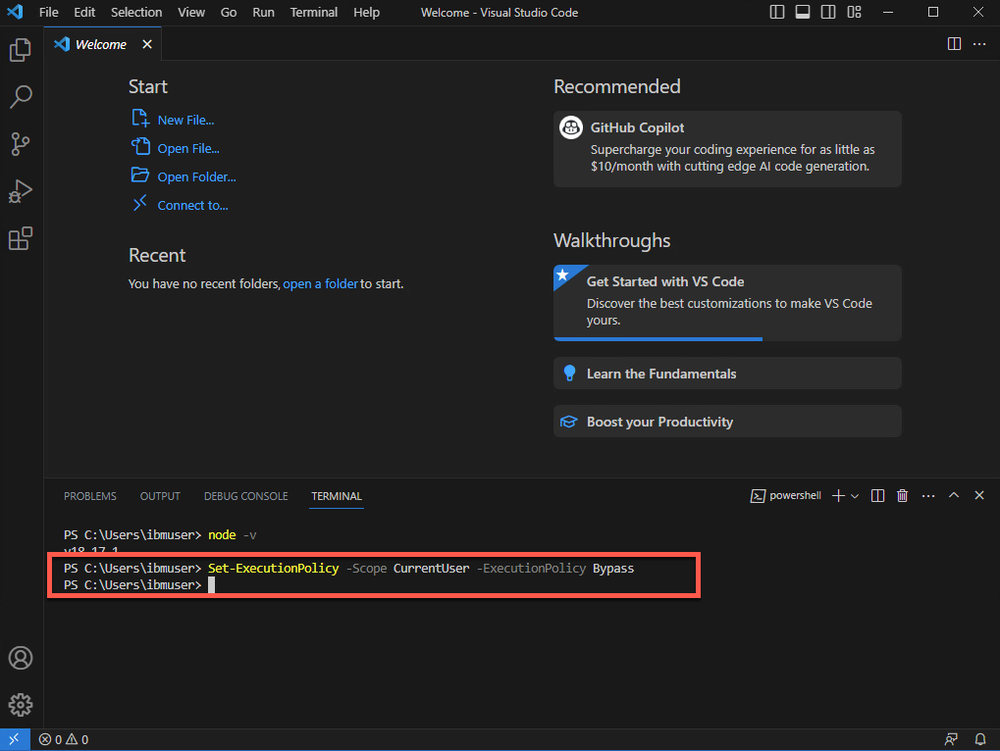

  それだ！これでラボの準備が整いました。息を整えて、ラボを楽しんでください。

***

## 3 - StepZen のセットアップ

このセクションでは、StepZen の使用を開始します。StepZen CLI をインストールし、StepZen アカウントでログインします。StepZen アカウントをお持ちでない場合は、前提条件セクションの作成方法を確認してください。

StepZen を使用すると、開発者は複数のバックエンドから必要なデータを取得する単一の GraphQL API を簡単に構築してデプロイできます。StepZen CLI は、StepZen API を作成、アップロード、デプロイ、テストするための主要なツールです。StepZen CLI を使用すると、StepZen のスキーマ、構成、エンドポイントを管理できます。CLI には、ブラウザーからローカルにデプロイした API を探索およびテストできる組み込みの Schema Explorer も付属しています。StepZen CLI は npm 経由で利用できるので、インストールしましょう。


1. 端末で以下のコマンドを実行して StepZen CLI をインストールします。
```
npm install -g stepzen
```


2. 次に、StepZenAccount でログインしましょう。ブラウザ ウィンドウに戻り、<a href="http://www.stepzen.com" target="_blank">以下の URL</a> を開き (1)、**ログイン** リンクをクリックします (2) ）。
```
http://www.stepzen.com
```


3. 個人アカウントをお持ちの場合は、ログインしてください。ラボの所有者から提供されたアカウントを使用している場合は、受け取った *ユーザー名* と *パスワード* を使用してログインします。


4. StepZen ダッシュボード ページの左側のメニューで、**アカウント** ページ (鍵のアイコン) を開きます。


5. ここには、CLI を使用してログインするために必要な情報がすべてあります。**アカウント**名 (1) と **管理者キー** (2)。それらは次のステップで使用します。


6. Visual Studio Code ターミナル ウィンドウで、以下のコマンドを実行して StepZen CLI にログインし、[your_account] をアカウント ページのアカウント値 (1) に置き換えます。
```
stepzen ログイン -a [あなたのアカウント]
```


7. ここで、管理者キーを入力する必要があります。「アカウント」ページから管理者キーの値 (2) をコピーして貼り付けます。
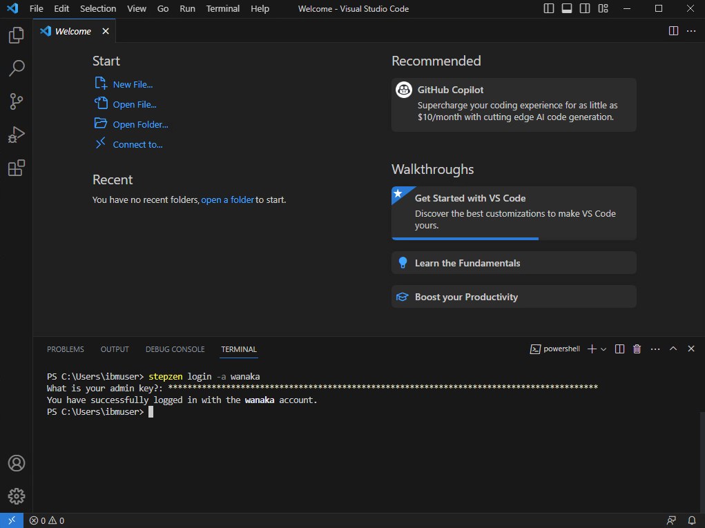

  これで、graphQL API を構築する準備が整いました。

  ***

## 4 - REST API から GraphQL API を構築する

StepZen CLI を使用すると、REST インターフェイスを備えたバックエンド用の GraphQL API を数分で作成できます。

REST バックエンドがある場合、StepZen を使用して GraphQL API を作成するには 2 つの方法があります。
  - コマンド ライン インターフェイス (CLI) コマンド stepzen importcurl を使用して、既存の REST エンドポイントを指定します。 StepZen はエンドポイントをイントロスペクトし、GraphQL スキーマを自動生成します。
  - スキーマ コードを .graphql GraphQL スキーマ定義言語 (SDL) ファイルに記述します。強力な GraphQL ディレクティブ @rest を使用して REST エンドポイントに接続すると、わずか数行のコードで機能するスキーマが完成します。)

このセクションでは、既存の REST API で stepzen importcurl を使用する方法を学習します。このコマンドは、curl リクエストを StepZen に送信し、JSON レスポンスから GraphQL タイプを解析します。

GraphQL API を構築する前に、新しいディレクトリを作成し、このディレクトリ内に StepZen ワークスペースを初期化しましょう。

1. Visual Studio Code ターミナルで、以下のコマンドを実行して新しいディレクトリを作成します。
```
mkdir product-demo
```


2. 新しいディレクトリに移動します。
```
cd product-demo
```


3. 現在のディレクトリで StepZen ワークスペースを初期化する必要があります。以下のコマンドを実行します。
```
stepzen init --endpoint=api/product-demo
```


4. 次に、StepZen を利用して REST エンドポイントをイントロスペクトし、GraphQL スキーマを自動生成しましょう。ここでは、事前に作成された REST API を使用します。
```
stepzen importcurl "https://introspection.apis.stepzen.com/customers" --query-name "customers"
```


5. 成功しました。最初の GraphQL API が作成されました。graphQL スキーマを調べてみましょう。Visual Studio Code で、**エクスプローラー** アイコン (1) をクリックし、**フォルダーを開く** (2) をクリックします。


6. 新しく作成した **product-demo** フォルダー (1) を選択し、**フォルダーの選択** をクリックします (2)。


7. 必要に応じて、[**はい、著者を信頼します**] ボタンをクリックします。
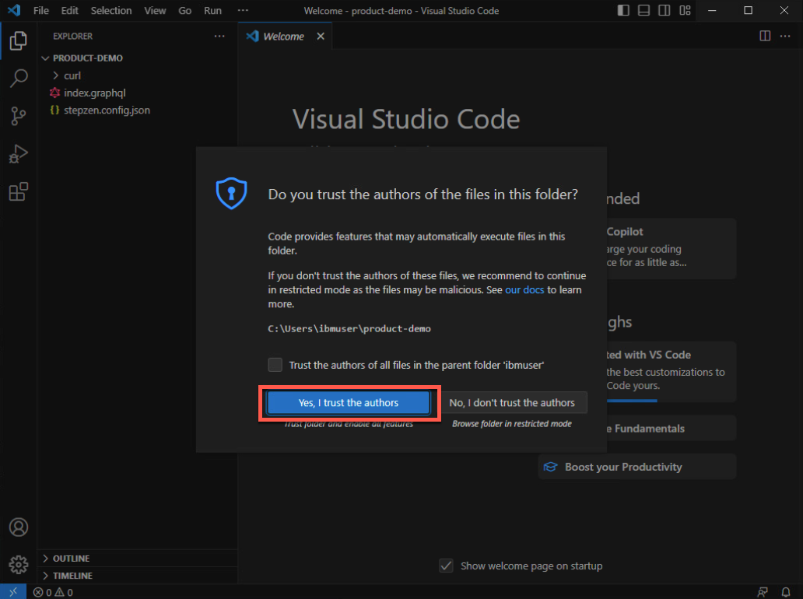

8. GraphQL スキーマを確認するには、**curl** フォルダーを開き、**index.graphql** ファイルを選択します (1)。.graphQL ファイル (2) を探索して確認してください。


9. 必要に応じて、[**表示 > ターミナル**] をクリックしてターミナル ウィンドウを再度表示します。


  この GraphQL はまだデプロイしません。その前に、別の REST エンドポイントをインポートしましょう。

***

## 5 - GraphQL API に新しい REST API を追加する

このセクションでは、別のエンドポイントをインポートします。やりましょう！

1. 以下のコマンドを実行して、別の REST API をインポートします。
```
stepzen import curl "https://introspection.apis.stepzen.com/orders" --query-name "orders" --query-type "Order"
```


2. 新しいgraphQLスキーマを確認するには、**curl-01**フォルダーを開き、新しい**index.graphql**ファイルを開きます(1)。新しいスキーマ (2) をぜひ試してみてください。


3. 3 番目のスキーマである **product-demo** フォルダー内の **index.graphql** ファイルを開き (1)、このスキーマが他の 2 つのスキーマを参照していることを確認します (2)。


4. これで、以下のコマンドを実行してエンドポイントを初期化できるようになります。
```
stepzen start
```


このコマンドは 3 つのことを行います
  - 現在のディレクトリ (または --dir フラグで指定されたディレクトリ) 内のコードを StepZen 上の指定されたエンドポイントにデプロイします。
  - ディレクトリの変更を監視し、指定されたエンドポイントに自動的に展開します。
  - StepZen の Schema Explorer と URL を共有すると、利用可能なクエリとタイプを調べたり、StepZen で実行されている API をクエリしたりすることで API をテストできます。


5. StepZen ダッシュボードは、GraphQL API をテストするためのプレイグラウンドを提供します。それを開いて、GraphQL API を調べてみましょう。ターミナル ページを下にスクロールして、API のダッシュボード URL を確認します。それをコピーしてブラウザウィンドウに貼り付けます。


6. StepZen Dahsboard では、さまざまなクエリを操作できます。[**クエリの実行**] ボタン (1) をクリックして注文クエリをテストします。結果データ(2)を確認します。


7. ビルダー セクション (1) を試して、さまざまな値のクエリを作成してください。たとえば、注文クエリを削除し、いくつかのフィールドを含む顧客クエリを作成します (2)。再度クエリを実行し(3)、結果データを確認します(4)。


  これらの結果により、2 つの異なる REST API からのデータを消費しています。また、さまざまな種類のデータ ソースの API を使用してそれを行うこともできます。次のセクションでは、MySQL データベースのデータを検査します。

***

## 6 - MySQL データベースから GraphQL スキーマを自動生成する

SQL データベース バックエンドがある場合、StepZen を使用して GraphQL API を作成するには 2 つの方法があります。
  - コマンドライン インターフェイス (CLI) コマンド stepzen import [mysql | mysql | mysql] を使用します。postgresql] を使用してデータベースを指定します。StepZen はデータベースをイントロスペクトし、GraphQL スキーマを自動生成します。
  - スキーマ コードを .graphql GraphQL スキーマ定義言語 (SDL) ファイルに記述します。GraphQL ディレクティブ @dbquery を使用してデータベースに接続すると、わずか数行のコードで機能するスキーマが完成します。)

このセクションでは、stepzen import mysql の使用方法を学びます。このラボでは、StepZen のサンプル MySQL データベースを使用します。

1. ターミナルに戻り、現在の実行をキャンセルします (CTRL+C)。そして、以下のコマンドを実行して、データベース バックエンドからデータを接続する GraphQL API を作成します。
```
stepzen import mysql --db-host='db.introspection.stepzen.net' --db-database='introspection' --db-user='testUserIntrospection' --db-password='HurricaneStartingSample1934' --name=mysql
```


2. 新しいgraphQLスキーマを確認するには、**mysql**フォルダーを開き、新しい**index.graphql**ファイルを開きます(1)。新しいスキーマ (2) をぜひ試してみてください。


  新しい API をデプロイする前に、次のセクションで MySQL データベースと REST API エンドポイントをマージします。

***

## 7 - @materializer を使用したビルディング ブロックの構成の作成

複数のサブグラフができたので、@materializer を使用してサブグラフ間で型をリンクできます。やりましょう！

1. **mysql** フォルダー (1) の **index.graphql** で、下にスクロールして '*type Query*' 宣言を確認します。「**Query for type 'Address'**」という文の下に、以下のクエリ コード (2) が含まれます。
```
getAddressById(id: Int!): [アドレス]
@dbquery(
  タイプ:「mysql」
  クエリ: """
  SELECT * FROM `address` where `id` = ?
  「」
  設定: "mysql_config"
)
```
このコードは、mySQL データベースからアドレスを選択するための getAddressById クエリを定義しています。


  ファイルを **保存**します ([ファイル] > [保存] または CTRL+S)。

2. 次に、**curl** フォルダーから **index.graphql** ファイルを開きます (1)。これは顧客の REST API からのスキーマです。下にスクロールして「*type RootEntry*」セクションを表示します。この時点では、アドレスは REST API エンドポイントから取得されています。この値を MySQL データベースから取得するように変更しましょう。現在のアドレス型定義(アドレス:Address)を以下のコード(2)に置き換えます。
```
住所: [住所]
  @materializer (クエリ: "getAddressById")
```


  ファイルを **保存**します ([ファイル] > [保存] または CTRL+S)。

3. 新しい API をデプロイしましょう。そして、StepZen ダッシュボードを更新します。
```
ステップゼンスタート
```
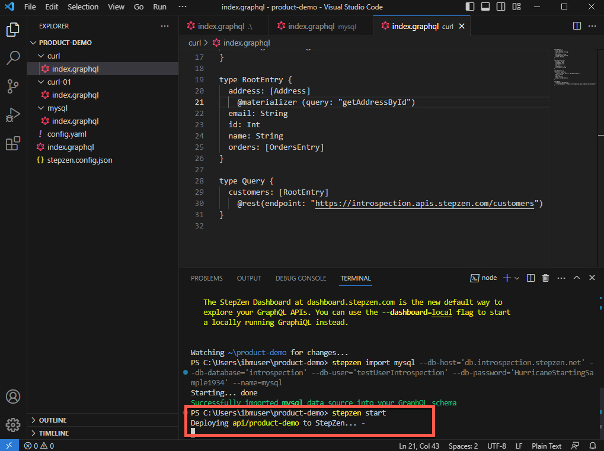

4. StepZen ダッシュボード ページで、ビルダー セクション (1) を使用して、住所属性を含む顧客クエリを作成します (2)。クエリを再度実行し (3)、結果データが Rest および MySQL データベースから取得されていることを確認します (4)。
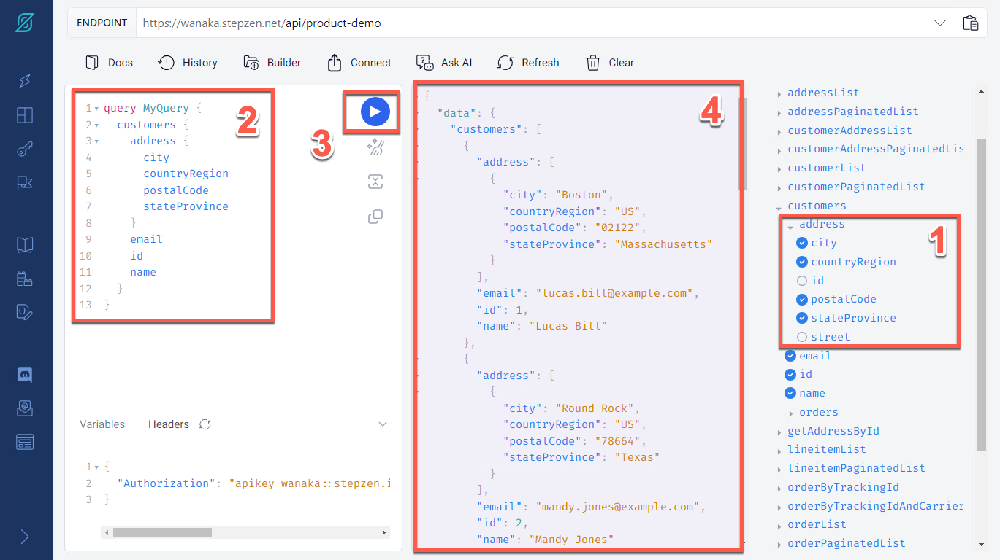

  素晴らしい！REST API と MySQL データベースから合成して、GraphQL API を作成しました。次のセクションでは、IBM API Connect を使用してこの API を管理する方法を説明します。

5. APIC セクションに進む前に、API エンドポイント (1) と認可ヘッダー (2) のコピーを取得します。これらは、後で API を呼び出すために必要になります。


ここで強調すべき重要な点の 1 つは、StepZen が GraphQL スキーマとエンドポイントへのアクセスをどのように制御するかについてです。

GraphQL API を構築するときは、これらのエンドポイントの不正使用を防ぐためにアクセス制御メカニズムを追加する必要があります。StepZen は、この問題に対して 2 つの異なる解決策をサポートしています。
  - API キー: API キーを使用して、エンドポイント全体へのアクセスを制御できます。API キーはデフォルトのアクセス制御メカニズムです。
  - フィールド ポリシー: フィールド ポリシーを使用して、エンドポイント上の特定のエントリ ポイント フィールドへのアクセスを制御できます。フィールド ポリシーは、属性ベースのアクセス制御と同様のモデルを使用して、GraphQL API へのきめ細かいアクセス制御を提供します。

StepZen は、アカウントで使用する 2 つの異なるタイプの API キー、管理者キーと API キーを提供します。管理者キーはアカウントへの管理レベルのアクセスを提供するもので、開発時にのみ使用してください。API キーはアカウントへのアクセスがより制限されているため、運用環境で使用する必要があります。

このラボでは、簡単にするために、管理者キーを使用して API にアクセスします。実際の環境では、API キーまたはフィールド ポリシーを使用して API のセキュリティを向上させる必要があります。

***

## 8 - APIC で GraphQL プロキシ API を作成する

IBM API Connect を使用すると、バックエンド GraphQL サーバーをプロキシする GraphQL API プロキシ定義を作成できます。API Connect は、GraphQL API 定義で、GraphQL リクエストの複雑さと、レート制限にカウントされる関連コストを計算するために使用される一連の設定を構成する機能を提供することにより、GraphQL 標準を拡張します。

ラボのこの部分では、API Connect 環境が必要です。必要に応じて、「前提条件」セクションを確認して、AWS トライアル アカウントで API Connect を作成する方法を確認してください。

1. ラボ モニターからラボ アカウントを受け取った場合は、<a href="https://privateemail.com/" target="_blank">メールの受信トレイ</a>を開いて APIC 環境の URL を取得する必要があります。 。受信トレイ (ラボのユーザーとパスワードでログイン) で **IBM SaaS** を検索し (1)、「**API Connect トライアルの準備ができました**」電子メールを開きます (2)。


2. 次に、**トライアル版にアクセス** ボタンをクリックします。
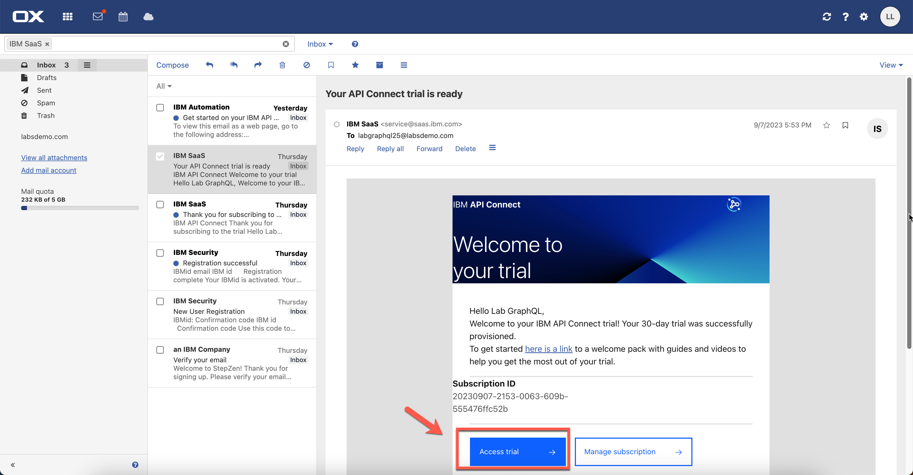

3. APIC ユーザーとパスワード (ラボ モニターから受け取ったものと同じユーザーとパスワード、または作成したアカウントを使用) でログインします。


4. ここでは、API Connect Enterprise as a Service 環境を使用しています。API Connect Enterprise as a Service は、IBM API Connect のクラウドベースのエディションです。API Connect Enterprise as a Service を使用すると、完全な API ライフサイクル管理のための最新のユーザー エクスペリエンス、イノベーション、業界標準を使用して、クラウドで作業して API を作成、管理、保護、ソーシャル化することができます。

  API Connect Enterprise as a Service は、配信モデルとして Software-as-a-Service を使用します。このモデルでは、API Connect は Amazon Web Services でホストされ、IBM によって管理されます。ソフトウェアの使用料を支払うだけで、基盤となるインフラストラクチャの所有と維持について心配する必要はありません。API Connect Enterprise as a Service では、AWS の請求書を通じて使用料金を支払います。

  GraphQL プロキシ API を作成する方法を見てみましょう。**ホーム** ページ (1) で下にスクロールし、**API の開発** タイル (2) をクリックします。
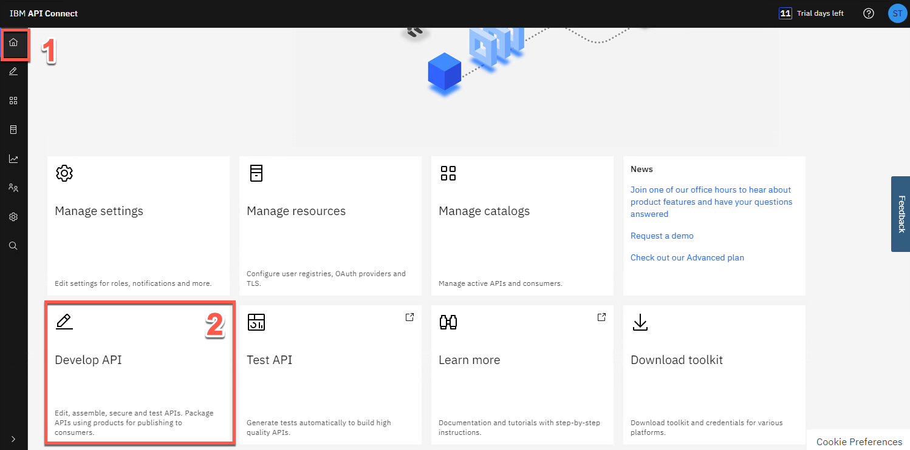

5. 次に、[**追加->API**] をクリックします。


6. GraphQL プロキシを作成するには、**既存の GraphQL サービス (GraphQL プロキシ) から** (1) を選択します。既存の GraphQL サーバーを指定すると、API Connect はサービスをイントロスペクトし、GraphQL プロキシ サービスを自動的に作成します。次に、[**次へ**] (2) をクリックします。


7. 次の値を入力します。

   タイトル: **お客様** (1)
   GraphQL サーバー URL: [*StepZen ダッシュボードからコピーした API URL*] (例: https://wanaka.stepzen.net/api/product-demo/__graphql) (2)


8. このラボで前に説明したように、StepZen API は API キー アプローチを使用してエンドポイント全体へのアクセスを制御します。そのため、HTTP ヘッダーの認証ヘッダーに API キーを含める必要があります。ここでは、このプロキシ API を設定するためのイントロスペクション用に API スキーマを読み取るためにこれを含めます。このスキーマは今回のみ使用され、後で API 自体を呼び出すために保存されることはありません。やりましょう！

   *HTTP ヘッダー* セクションで、**追加** (1) をクリックして *ヘッダー* として **認可** (2) を入力し、*StepZen ダッシュボード ヘッダー* セクションからコピーした *API キー値* を貼り付けます。 *値*として (3)。次に、[次へ] (4) をクリックします。


9. スキーマ検証ツールは、警告とエラーが見つかった場合に報告します。ここではスキーマ警告を無視してください。この警告は後の手順で修正されます。[パス] セクションで、使用可能なエンドポイントを **すべて** 選択し (1)、**次へ** をクリックします (2)。


10. [**クライアント ID を使用したセキュリティ保護**] と [**CORS**] の両方をオンのままにして (1)、[**次へ**] をクリックします (2)。


11. 素晴らしい！API Connect は GraphQL プロキシ API を正常に作成しました。


***

## 9 - GraphQL プロキシ API の編集とテスト

1. 次に、API を編集して、作成したばかりのプロキシ API の詳細を表示しましょう。[**API の編集**] をクリックして続行します。


2. GraphQL API は、いくつかの追加オプションを備えた REST API と同じ構造になっています。REST API と同様に、左側のメニュー バーからセキュリティ スキーマ、パス、定義を追加できます。REST API と同様に、*ゲートウェイ*、*テスト*、*エクスプローラー* タブを表示することもできます。GraphQL API の新しいタブに気づくでしょう。[**GraphQL スキーマ**] タブをクリックしてスキーマを表示します。


3. [GraphQL スキーマ] タブには、GraphQL スキーマ内のすべてのタイプのタイプと、各タイプのコストまたは費用のタイプの重み情報が表示されます。重み係数は、GraphQL API へのリクエストのタイプ コストを計算するときに使用されます。たとえば、値を取得するためにサーバー上で大量の CPU またはメモリを使用する必要があるフィールドには、より高いコストが割り当てられます。*警告* メッセージで [**表示**] をクリックします。


4. 警告ウィンドウには、警告の詳細に加えて、制限を適用して警告を修正するオプションが表示されます。この人工知能は多くの場合非常に正確ですが、実際のシナリオでは、アプリケーションのセキュリティに影響を与えるため、結果を慎重に調べ、正確な場合にのみ受け入れることが重要です。この例では、**すべて適用** (1) をクリックし、次に **適用** (2) をクリックします。


5. 推奨事項を適用すると、警告メッセージが削除されます。[**保存**] をクリックして API 定義を保存します。


6. 次に、**ゲートウェイ** ビューを開いてみましょう。
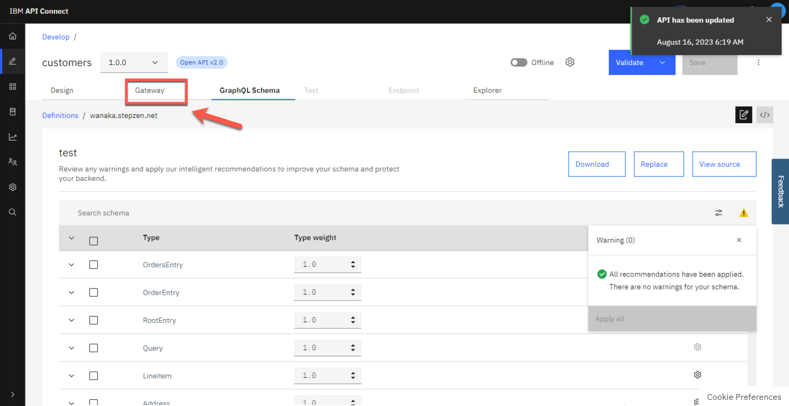

7. フローは、最初の API 作成の一部として自動的に作成されます。項目をパレットからキャンバスにドラッグ アンド ドロップすることで、追加のロジックを適用できます。Authorization ヘッダーの伝達を許可するために小さな変更を加えてみましょう。フロー (1) を下にスクロールし、**Otherwise** 分岐 (2) に **graphql-invoke** ノードが表示されます。それをクリックして編集します (3)。


8. *graphql-invoke* ノード定義で、下にスクロールして *Header control* セクションを表示します。[**許可リストの追加**] をクリックして、リストに新しいヘッダーを追加します。


9. 許可される新しいヘッダーとして **Authorization** と入力し (1)、**保存** ボタンをクリックします (2)。これは、Authorization ヘッダーをバックエンドに送信することを意味します。


10. 次に、API をテストしてみましょう。API を公開するには、ボタンをオフラインから **オンライン**に切り替えます。


11. API を API Gateway に正常に公開すると、画面に追加のタブが表示されます。[**テスト**] タブを選択して API をテストします。


12. テスト機能には、GraphQL エディターも含まれています。GraphQL エディターに次の GraphQL クエリを入力します。これは JSON ではありませんが、応答として返される JSON に似ています。**Prettify** オプションを使用して、GraphQL クエリの視覚化を改善できます。
```
{
  顧客 {
    Eメール
    ID
    名前
    住所 {
      市
      国地域
      郵便番号
      州州
    }
  }
}
```
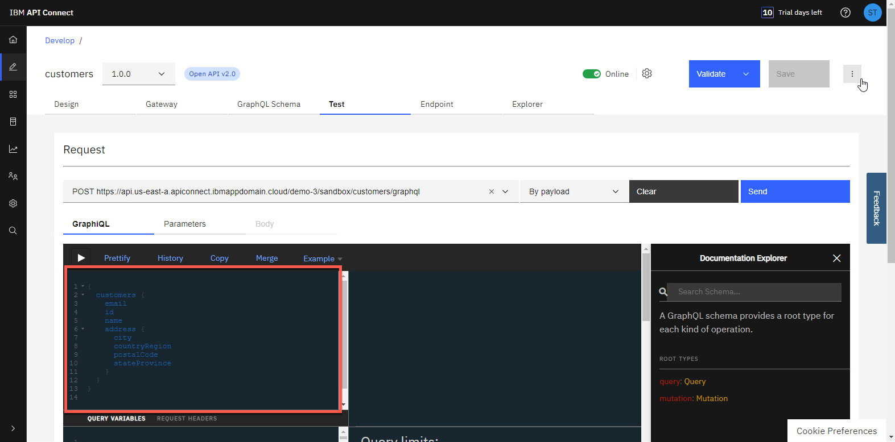

13. 次に、聞いた承認を含める必要があります。[**パラメータ**] タブを開きます。


14. API を呼び出すたびに、API キーを Authorization ヘッダーとして渡す必要があります。それでは、それをテストに含めてみましょう。[パラメータ] リストの一番下に、次の値を持つ新しいパラメータを追加します。

    キー: **権限** (1)
    場所: **ヘッダー** (2)
    値: *[StepZen ダッシュボード ヘッダーからコピーした API キー値を貼り付けます]* (3)


15. [**送信**] ボタン (1) をクリックし、[**GraphiQL**] タブ (2) を再度開いて結果を確認します。


16. [トレース] セクションに HTTP ステータス: 200 (1) が表示され、応答データには GraphQL API から返されたデータが表示されます (2)。


17. これは素晴らしいことですが、GraphQL API プロキシ フローで Authorization ヘッダー パラメーターをハードコーディングすることで簡素化できます。やりましょう！[**ゲートウェイ**] タブを再度開きます。
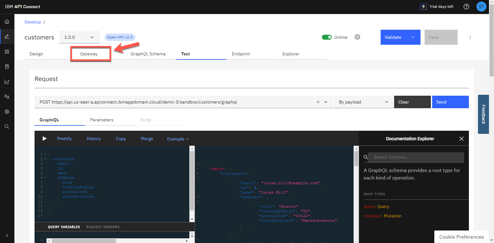

18. *Parse* で始まる **Otherwise** (1) で、*graphql-invoke* ノードの前にノードを追加します。*パレット* ビューで、下にスクロールして *ポリシー* セクション (2) を表示します。**Set Variable** (3) ノードを、「*ratelimit Expected*」ノードと「*graphql-invoke*」ノード (4) の間にドラッグ アンド ドロップします。


19. タイトルとして **set-authorization** と入力し (1)、**アクションの追加** をクリックします (2)。


20. アクションのタイプとして **Set** (1) を維持します。「設定」フィールドに、設定する変数の名前として「**message.headers.Authorization** (2)」と入力します。設定する値のタイプとして **String** (3) を選択します。[*値*] フィールドに、StepZen ダッシュボード ヘッダー* からコピーした *API キー値を貼り付けます (4)。


21. 次に、[**保存**] をクリックします。


22. もう一度 API をテストしてみましょう。今回は認可トークンを渡さずに行います。[**テスト**] タブ (1) を開き、[**クエリの実行**] ボタン (2) をクリックします。(注: 必要に応じて、[パラメータ] タブで、Authorization ヘッダー パラメータがないことを確認できます)。


23. 素晴らしい！これで、GraphQL プロキシが実行され、使用できるようになりました。GraphQL クエリを変更して、より多くのシナリオをテストすることもできます。[**例**] ボタンを使用して、創造性を発揮することもできます。次のセクションでは、GraphQL RateLimits を適用するプロダクトを作成する方法を学びます。ブレッドクラムで、**開発** ページに戻ります。


***

## 10 - プロダクトを作成し、GraphQL RateLimits を適用する

1. [**追加->製品**] をクリックします。


2. **新しい製品** (1) を選択し、**次へ** (2) をクリックします。


3. 製品に **Customers Product** という名前を付け (1)、**次へ** (2) をクリックします。


4. **顧客** (1) を選択して、顧客 API を製品に追加します。次に、[**次へ**] (2) をクリックします。
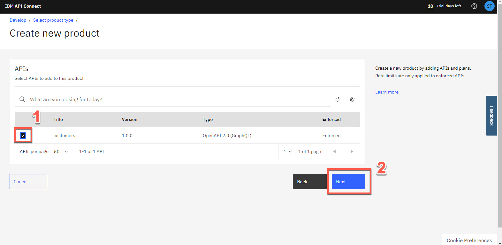

5. *デフォルト プラン* には従来のレート制限オプションが含まれていますが、次のステップで GraphQL レート制限をリストできるようになります。ここでは、[**次へ**] をクリックしてください。


6. **[製品の公開]** (1) を選択して、製品をサンドボックス カタログに公開します。*可視性* と *購読性* (2) のデフォルトを受け入れ、**次へ** (3) をクリックします。


7. 素晴らしい！新しい製品があります。[**完了**] をクリックします。


8. *開発* ビューに戻り、**製品** タブ (1) を開き、**顧客製品** (2) をクリックします。


9. **プラン** セクションを開き (1)、*デフォルト プラン* で **コンテキスト メニュー** を開き (2)、**編集** (3) を選択します。
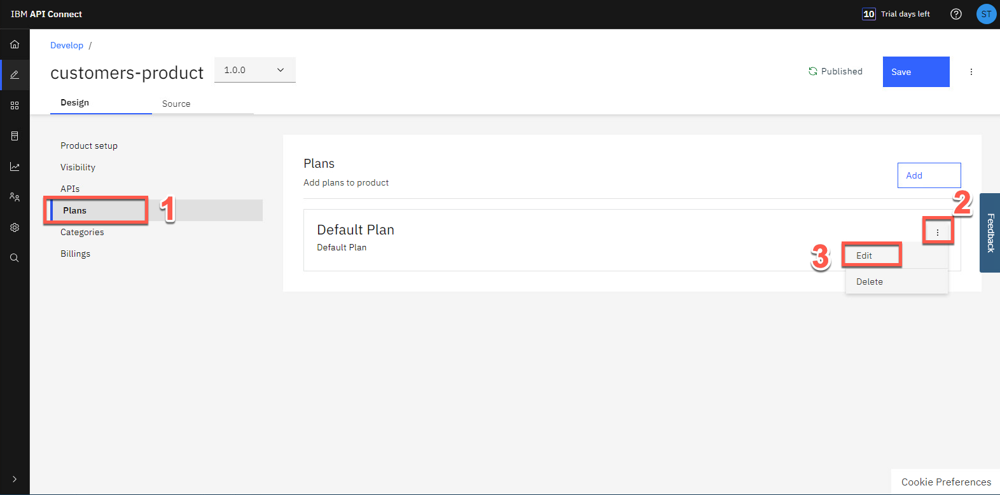

10. 下にスクロールすると、GraphQL のレート制限が表示されます。このセクションから GraphQL のコスト パラメーターを調整できます (フィールドまたはタイプごとのコストを含む)。制限を設定することも、無制限にすることもできます。このチュートリアルでは、何も変更しません。

    GraphQL のレート制限がどのように機能するかを理解したい場合は、これを確認してください <a href="https://www.ibm.com/docs/en/api-connect/10.0.x?topic=api-securing-graphql-by -using-client-id" target="_blank">ドキュメント ページ</a>。


11. 左側のメニューで、**管理** アイコンをクリックして、サンドボックス カタログを管理します。


    次のセクションでは、開発者ポータルを調べます。

***

## 11 - 開発者ポータルから API を探索する

API を公開したので、API コンシューマーがそれを検出して使用できることを確認する必要があります。開発者ポータルを使用すると、顧客は API の表示、セルフサービス方式でのプランへのサインアップとサブスクライブ、API のテスト、OpenAPI - Swagger ドキュメントのダウンロードなどを行うことができます。調べてみましょう。

1. ポータルの URL を取得しましょう。*管理* ページで、**サンドボックス** カタログを開きます。


2. **カタログ設定** をクリックし (1)、**ポータル** タブを開きます (2)。


3.これで、**ポータル URL** が得られました。それをコピーし、ブラウザーの新しいタブで開きます。

  「注」: 環境にポータル URL がない場合は、新しいポータルを作成してください。ポータルの準備ができるまでに数分かかります。


4. この開発者ポータルは公開 Web サイトであるため、柔軟性が高くカスタマイズ可能ですが、デフォルトのデザインを使用します。これらの次のステップはすべて、API コンシューマ、つまりエンドユーザー顧客が API を検索、購入、使用するために行うことをシミュレートしていることに注意してください。[**アカウントの作成**] をクリックして、新しい開発者アカウントを作成します。


5. 登録フォームに必要事項を記入し、個人の電子メールを使用してください。ユーザー名 (電子メールではない) とパスワードをメモしておきます。これらは、後で開発者ポータルにログインするために必要になります。


6. 新しい開発者アカウントをアクティブ化するための電子メールが届きます。リンクをクリックして登録を検証します。


7. 開発者の *ユーザー名* と *パスワード* (2) を使用して、開発者ポータルに **サインイン** (1) します。


8. 開発者ポータルには、現在公開されているすべての製品が表示されます。あなたの場合、アプリはまだ作成されていません。消費者/開発者として、ポータルで新しいアプリケーションを作成します。これにより API キーが得られ、API を呼び出すことができるようになります。[**新しいアプリの作成**] をクリックします。


9. **アプリのタイトル**として「**コンシューマ アプリケーション**」と入力します (1)。[**保存**] (2) をクリックします。


10. [**認証情報**] ダイアログ ボックスで、*API キー* (1)、*API シークレット* (2) をコピーし、**OK** (3) をクリックします。


11. API をまだサブスクライブしていないので、今すぐサブスクライブしましょう。**利用可能な API を参照してみませんか?** リンクをクリックします。


12. [**顧客製品 1.0.0**] をクリックします。


13. [**デフォルト プラン**] セクションで、[**選択**] をクリックします。


14. **コンシューマ アプリケーション**を選択します。


15. [**次へ**] をクリックしてサブスクリプションを確認します。


16. [**完了**] をクリックします。


17. 製品画面に戻りました。ここで API を調べてみましょう。**顧客 1.0.0 API** をクリックします。


18. *概要* ページから、OpenAPI ドキュメントをダウンロードし、API エンドポイントを取得できます。ポータルには、API を呼び出すために必要なものがすべて揃っていることに注意してください。[**試してみる**] タブを開きます。


19. 前の手順 (1) でコピーした API キーを貼り付けます。以下の GraphQL を GraphQL エディターに貼り付けます (2)。そして、[**クエリの実行**] ボタン (3) をクリックします。
```
{
  顧客 {
    Eメール
    ID
    名前
    住所 {
      市
      国地域
      郵便番号
      州州
    }
  }
}
```


20. 素晴らしい！GraphQL プロキシ API が実行されており、エコシステムで利用できます。GraphQL エディターを使用して、引き続き API のテストを行ってください。異なるフィールド名でリクエストを送信し、結果ウィンドウに結果がどれだけ早く返されるかを観察します。これが REST API の場合、同じ結果を達成するには複数のエンドポイントが必要になります。


21. これは、API コンシューマ、つまり有料顧客としての経験でした。ここで、呼び出される API を使用する API プロバイダーとしてのエクスペリエンスに戻ります。アプリケーションの使用状況に関する分析情報が得られます。**アプリ** ページ (1) を開き、**コンシューマ アプリケーション** (2) を選択します。


22. このページでは、開発者はアプリケーションに関する情報と洞察を表示できます。


おめでとう！このラボは正常に完了しました。


***

＃＃ まとめ

今日やったことをまとめてみましょう。

このラボでは、GraphQL ドメインでゼロからエンタープライズに移行しました。最初に、StepZen を使用して、異なるソース (REST API と MySQL) からデータを取得してフェデレーション GraphQL API を作成する方法を学びました。その後、IBM API Connect を使用して、StepZen からバックエンド GraphQL API をプロキシする GraphQL API プロキシ定義を作成する方法を学習し、リクエストによってサーバーから返されるデータ量を反映するレート制限制御を定義する方法を確認しました。 GraphQL API に。

StepZen の技術情報の詳細については、この<a href="https://stepzen.com/docs" target="blank">ページ</a>を確認してください。API Connect Enterprise as a Service の詳細については、<a href="https://www.ibm.com/docs/en/api-connect/saas?topic=api-connect-enterprise-as-service』を参照してください。 -概要" target="blank">ページ</a>。