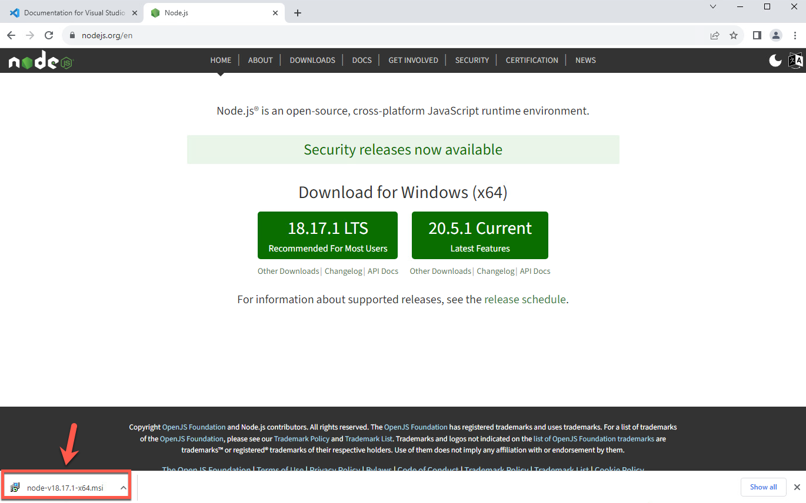
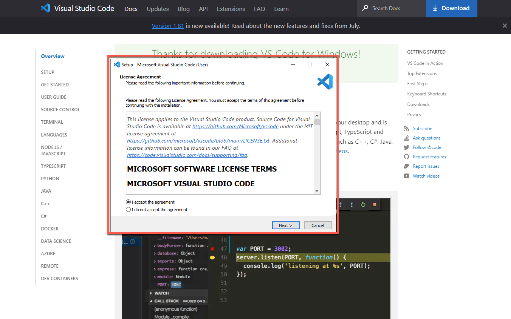
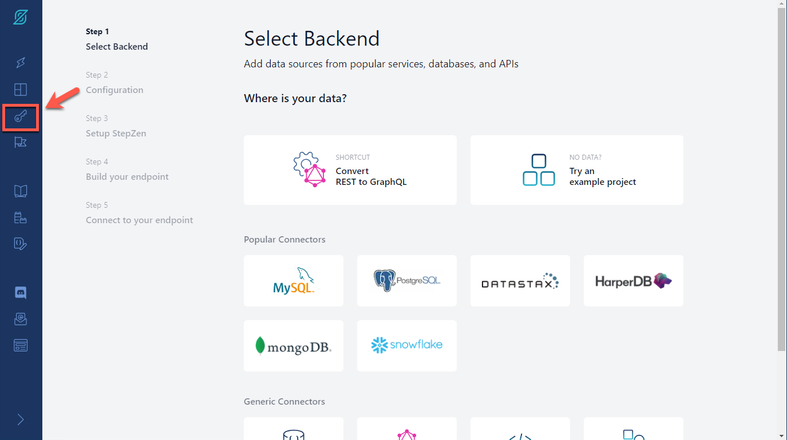
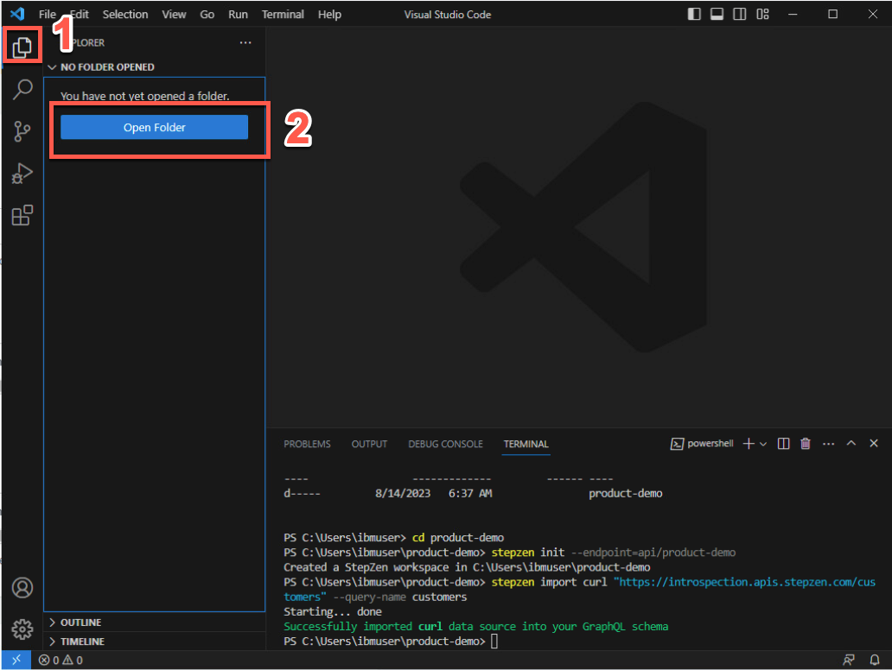
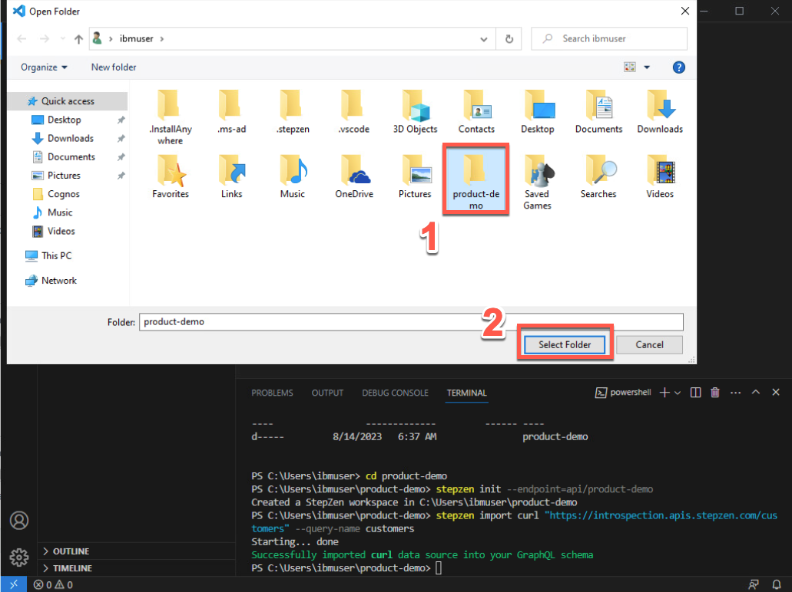

## ラボの概要

ハイブリッド クラウドの採用の増加により、データはさまざまなクラウドやオンプレミス環境だけでなく、データ ウェアハウス、レイク、レイクハウスなどのさまざまな種類のデータ ストアにも、あらゆる場所に保存されるようになりました。API は、さまざまなデータ ソースとアプリケーション間の重要なコネクターとして機能します。これは、企業がアプリケーションやエクスペリエンスを強化するために必要なデータを取得するために、これまで以上に多くの API に依存し、作成していることを意味します。

GraphQL は、企業がデータを操作するための頼りになるクエリ言語として急速に普及し、REST API とデータ システムへの投資を重ねる API の新しい標準として浮上しています。GraphQL API はアプリケーション チームにとって非常に使いやすいものですが、その構築を担当する API プロバイダー チームにとっては課題となる可能性があります。私たちは、宣言的に構築された API の方が単純に優れていると信じています。これにより、クリーンなコード行が減り、デプロイ時間が短縮され、パフォーマンス、コスト、信頼性の最適化が組み込まれた API で最初の実装が可能になります。

宣言的にプログラミングする場合、システムを構成することになります。また、すべてのクエリにわたって、さまざまな状況に適用できる普遍的なルールをシステムに提供することになります。結果として得られるコードは耐障害性が向上し、(DRY 原則に従って) ソフトウェア パターンの繰り返しが減り、理解と保守が容易になります。重要なのは、これにより、本来なら自分でコーディングする必要がある作業をプラットフォームが実行できるようになります。

StepZen を使用すると、開発者は複数のバックエンドから必要なデータを取得する単一の GraphQL API を簡単に構築してデプロイできます。API は、バックエンド プロトコル、スキーマ、認証に関係なく、適切なデータを確実に配信します。開発者がインフラストラクチャを管理しないように API を管理します。

StepZen の宣言型アプローチを使用すると、開発者は GraphQL ビルディング ブロックを構成して GraphQL スキーマを作成することで、GraphQL API (およびフェデレーション グラフ) を構築できます。強力なイントロスペクション機能は、エンタープライズ データの GraphQL モデルをわずか数行のコードで構築および構成できることを意味します。

API を宣言的に構築するため、StepZen は API を理解し、実行時に最適化の決定を下すことができ、低レイテンシーと高スループットを実現し、バックエンドへの負担を最小限に抑えます。

API Connect を使用すると、開発者は API を簡単に管理、保護、ソーシャル化、監視できます。StepZen の前に API Connect を配置すると、GraphQL、REST、SOAP、その他の形式の API をすべて 1 つの製品に組み込んだ API 製品を簡単に構築できます。その後、独自の使用条件を持つさまざまな API プランに基づいて API 製品を販売することができます。製品とプランを設定すると、セルフサービスの開発者ポータルを使用してそれらを宣伝し、エンド ユーザーにソーシャル化することができます。これにより、顧客は、積極的に関与しなくても、API 製品を見つけて試し、支払いを行うことができます。最後に、API の使用状況を監視して、問題だけでなく傾向も把握できます。

API Connect 管理は、新しい GraphQL API と既存の REST API を統合すると同時に、新しい StepZen GraphQL API に最高クラスのセキュリティも提供します。脅威保護、レート制限、収益化はすべて、すべてのトランザクションの入力 GraphQL クエリの高度にカスタマイズされた分析に基づいて行うことができ、ユーザーによるわずかな宣言的アサーションが必要です。スキーマのどの部分がより高価であるかを API Connect に伝えると、API Connect はそれを顧客からのすべてのクエリに合わせてカスタマイズします。

このラボが終了するまでに、StepZen と API Connect を組み合わせて、異種のバックエンド (バックエンド間のリンクを含む) を単一の API に結合するための世界クラスのシステムをデプロイし、API を保護し、顧客にソーシャル化して、その呼び出しを監視しました。

始めましょう！


## 前提条件

IBM API Connect 環境が必要です。このラボの一環として、AWS で IBM API Connect as a Service を使用します。アカウントをお持ちでない場合は、この <a href="https://ibm-integration.github.io/learninghub/labs/trial-aws/#1-start-your-ibm-api-" の手順に従ってください。 connect-trial-on-aws" target="_blank">ドキュメント</a>を参照して、30 日間のトライアルアカウントを作成します。

StepZen アカウントが必要です。StepZen は、開発者が GraphQL API を構築する簡単な方法を提供します。StepZen は宣言型プログラミング アプローチ (HOW を明示的に指定せずに、プログラムが何を行うかを記述する) を採用しており、その結果、コードがより小さく直感的になり、実行時のパフォーマンスが向上し、価値実現までの時間が短縮されます。StepZen は柔軟性が非常に高いように設計されています。他の API アプローチと互換性があり、サービスとして (SaaS) で利用できるほか、プライベート クラウドやオンプレミス データ センターでの展開もサポートしています。アカウントをお持ちでない場合は、<a href="https://stepzen.com/signup" target="_blank">こちら</a>から無料の StepZen アカウントを作成して開始できます (クレジット カードは必要ありません)必須）。


## ビジネスコンテキスト

あなたの会社は、API の新しい標準として GraphQL に投資することを決定しました。GraphQL は API 用のクエリ言語であり、REST API リクエストと比較して、アプリケーション クライアントが API リクエストで取得するデータをより詳細に制御できるようになります。

あなたは、開発者があらゆる場所に保存されているデータを使用して GraphQL API を構築する簡単な方法を模索したいと考えています。電子商取引アプリケーションを例に考えてみましょう。GraphQL は、1 回の呼び出しで、顧客情報、注文番号、配送ステータスなど、さまざまなサブシステムにあるデータを結合し、期待される形式で返すことができます。GraphQL API はアプリケーション チームにとって非常に使いやすいものですが、その構築、セキュリティ保護、ソーシャル化、管理を担当する API チームにとっては課題となる可能性があります。これらの API の構築プロセスを容易にするために、データへのフェデレーション アクセスのための宣言的アプローチを使用して GraphQL API を作成する方法を検討したいと考えています。

一方、開発者は、社内での GraphQL API の使用管理に問題を抱えています。

GraphQL には、REST API に比べて次のような特別な利点があります。

  - アプリケーションクライアントは、必要なデータのみをリクエストできます。たとえば、銀行口座レコードを取得する場合は、各口座の口座番号と現在の残高のみを要求し、顧客名や住所の詳細は要求しません。REST API リクエストでは、バックエンド REST サービスがさまざまなデータ サブセットに個別のエンドポイントまたはパラメータを提供するか、アプリケーション クライアントが完全なレコードを取得して不要なデータを破棄する必要があります。

  - アプリケーションクライアントは、単一のリクエストで複数の関連リソースを取得できます。たとえば、顧客の銀行口座レコードには、顧客が保有する他の金融商品を参照する配列が含まれる場合があります。アプリケーション クライアントが特定の顧客の銀行口座の詳細と、その顧客の他の金融商品の詳細を取得したい場合、クライアントは REST API を使用してまず銀行口座の詳細を取得し、次にそれぞれの銀行口座の詳細を個別にリクエストします。他の製品。GraphQL API は、クライアントが 1 回のリクエストでこのすべての情報を取得できるように設計できます。

ただし、この柔軟性にはレート制限に関するセキュリティ上の課題が伴います。これは、一見非常によく似た 2 つのリクエストが、非常に異なる量のデータを返す可能性があり、複数の REST API リクエストが必要であったものが、それぞれがレート制限にカウントされる可能性があるため、単一の GraphQL API リクエストしか必要としない可能性があるためです。 。したがって、取得されるデータの量を反映するレート制限制御を課すことが重要です。


## ラボの概要

このラボでは、GraphQL ドメインでゼロからエンタープライズに移行する方法を学びます。最初に、StepZen を使用して、異なるソース (REST API と MySQL) からデータを取得してフェデレーション GraphQL API を作成する方法を学びます。その後、IBM API Connect を使用して、StepZen からバックエンド GraphQL サーバーをプロキシする GraphQL API プロキシ定義を作成し、GraphQL API へのリクエストによってサーバーから返されるデータ量を反映するレート制限制御を定義します。

このラボでは、次のセクションを完了します。

  - 1 - Node.JS をインストールする
  - 2 - IDE をインストールする
  - 3 - StepZen のセットアップ
  - 4 - REST API から GraphQL API を構築する
  - 5 - GraphQL API に新しい REST API を追加する
  - 6 - MySQL データベースから GraphQL スキーマを自動生成する
  - 7 - @materializer を使用したビルディング ブロックのコンポジションの作成
  - 8 - APIC で GraphQL プロキシ API を作成する
  - 9 - GraphQL プロキシ API の編集とテスト
  - 10 - プロダクトを作成し、GraphQL RateLimits を適用する
  - 11 - 開発者ポータルから API を探索する


## 1 - Node.JS をインストールする


このセクションでは、Node.JS をマシンにインストールします。始めましょう！

1. ラボ環境を起動し、ブラウザを開きます。


2. <a href="https://nodejs.org" target="_blank">以下の URL</a> を開きます (1)。そして、推奨されるnode.jsバージョンをダウンロードしてください。
```
https://nodejs.org
```


3. ノードのインストールをマシンに保存し、実行します。


4. デフォルト値を受け入れ、[**インストール**] をクリックしてインストールを完了します。


5. 完了したら、[**完了**] をクリックします。


## 2 - IDE をインストールする

**統合開発環境 (IDE)** は、プログラムの開発、コンパイル、リンク、デバッグに必要なものがすべて含まれたソフトウェアです。さらに、IDE には通常、統合ヘルプ、名前補完、自動フォーマット、場合によってはバージョン管理システムなど、その他の便利な編集機能が多数バンドルされています。したがって、これらすべてのことを個別に実行することもできますが、IDE をインストールして、単一のインターフェイスからすべてにアクセスできるようにする方がはるかに簡単です。

このラボでは、IDE を使用して GraphQL スキーマを調査します。好みの IDE を使用してください。特に希望がない場合は、以下の手順に従って Visual Studio Code をインストールできます。


1. ブラウザで、<a href="https://code.visualstudio.com/Download" target="_blank">以下の URL</a> を開きます (1)。そして、お使いの OS に固有の VSCode ユーザー インストーラーをダウンロードします (2)。
```
https://code.visualstudio.com/Download
```


2. VSCode インストールをマシンに保存し、実行します。


3. インストール手順に従ってインストールを完了します。


4. 最後に、**Visual Studio Code を起動する** オプションをオンにして、**完了** をクリックします。


5. [**ようこそ**] タブを閉じます。


6. [**ターミナル**] メニューを開き、[**新しいターミナル**] をクリックします。


7. 素晴らしい！Visual Studio Code の下部にターミナル ウィンドウが表示されるはずです。以下のコマンドを入力して、ノードのインストールが正常かどうかを確認します (コマンドの結果として、ノードのバージョンが表示されるはずです)。
```
node -v
```


8. Windows マシンを使用している場合は、VS Code ターミナルでスクリプトを実行できるように PowerShell 実行ポリシーを変更する必要があります。実行ポリシーは、PowerShell セキュリティ戦略の一部です。実行ポリシーは、PowerShell プロファイルなどの構成ファイルをロードできるかどうか、またはスクリプトを実行できるかどうかを決定します。やりましょう！Visual Studio Code のターミナル ウィンドウで、以下のコマンドを実行します。
```
Set-ExecutionPolicy -Scope CurrentUser -ExecutionPolicy Bypass
```


  それだ！これでラボの準備が整いました。息を整えて、ラボを楽しんでください。

## 3 - StepZen のセットアップ

このセクションでは、StepZen の使用を開始します。StepZen CLI をインストールし、StepZen アカウントでログインします。StepZen アカウントをお持ちでない場合は、前提条件セクションの作成方法を確認してください。

StepZen を使用すると、開発者は複数のバックエンドから必要なデータを取得する単一の GraphQL API を簡単に構築してデプロイできます。StepZen CLI は、StepZen API を作成、アップロード、デプロイ、テストするための主要なツールです。StepZen CLI を使用すると、StepZen のスキーマ、構成、エンドポイントを管理できます。CLI には、ブラウザーからローカルにデプロイした API を探索およびテストできる組み込みの Schema Explorer も付属しています。StepZen CLI は npm 経由で利用できるので、インストールしましょう。


1. 端末で以下のコマンドを実行して StepZen CLI をインストールします。
```
npm install -g stepzen
```


2. 次に、StepZenAccount でログインしましょう。ブラウザ ウィンドウに戻り、<a href="http://www.stepzen.com" target="_blank">以下の URL</a> を開き (1)、**ログイン** リンクをクリックします (2) ）。
```
http://www.stepzen.com
```


3. 個人アカウントをお持ちの場合は、ログインしてください。ラボの所有者から提供されたアカウントを使用している場合は、受け取った *ユーザー名* と *パスワード* を使用してログインします。


4. StepZen ダッシュボード ページの左側のメニューで、**アカウント** ページ (鍵のアイコン) を開きます。



5. ここには、CLI を使用してログインするために必要な情報がすべてあります。**アカウント**名 (1) と **管理者キー** (2)。それらは次のステップで使用します。


6. Visual Studio Code ターミナル ウィンドウで、以下のコマンドを実行して StepZen CLI にログインし、[your_account] をアカウント ページのアカウント値 (1) に置き換えます。
```
stepzen ログイン -a [あなたのアカウント]
```


7. ここで、管理者キーを入力する必要があります。「アカウント」ページから管理者キーの値 (2) をコピーして貼り付けます。


<<<<<<< HEAD
  これで、graphQL API を構築する準備が整いました。

  ## 4 - REST API から GraphQL API を構築する

StepZen CLI を使用すると、REST インターフェイスを備えたバックエンド用の GraphQL API を数分で作成できます。

REST バックエンドがある場合、StepZen を使用して GraphQL API を作成するには 2 つの方法があります。
  - コマンド ライン インターフェイス (CLI) コマンド stepzen importcurl を使用して、既存の REST エンドポイントを指定します。 StepZen はエンドポイントをイントロスペクトし、GraphQL スキーマを自動生成します。
  - スキーマ コードを .graphql GraphQL スキーマ定義言語 (SDL) ファイルに記述します。強力な GraphQL ディレクティブ @rest を使用して REST エンドポイントに接続すると、わずか数行のコードで機能するスキーマが完成します。)

このセクションでは、既存の REST API で stepzen importcurl を使用する方法を学習します。このコマンドは、curl リクエストを StepZen に送信し、JSON レスポンスから GraphQL タイプを解析します。

GraphQL API を構築する前に、新しいディレクトリを作成し、このディレクトリ内に StepZen ワークスペースを初期化しましょう。

1. Visual Studio Code ターミナルで、以下のコマンドを実行して新しいディレクトリを作成します。
```
mkdir product-demo
```


2. 新しいディレクトリに移動します。
```
cd product-demo
```


3. 現在のディレクトリで StepZen ワークスペースを初期化する必要があります。以下のコマンドを実行します。
```
stepzen init --endpoint=api/product-demo
```


4. 次に、StepZen を利用して REST エンドポイントをイントロスペクトし、GraphQL スキーマを自動生成しましょう。ここでは、事前に作成された REST API を使用します。
```
stepzen import curl "https://introspection.apis.stepzen.com/customers" --query-name "customers"
```


5. 成功しました。最初の GraphQL API が作成されました。graphQL スキーマを調べてみましょう。Visual Studio Code で、**エクスプローラー** アイコン (1) をクリックし、**フォルダーを開く** (2) をクリックします。


6. 新しく作成した **product-demo** フォルダー (1) を選択し、**フォルダーの選択** をクリックします (2)。


7. 必要に応じて、[**はい、著者を信頼します**] ボタンをクリックします。


8. GraphQL スキーマを確認するには、**curl** フォルダーを開き、**index.graphql** ファイルを選択します (1)。.graphQL ファイル (2) を探索して確認してください。


9. 必要に応じて、[**表示 > ターミナル**] をクリックしてターミナル ウィンドウを再度表示します。


  この GraphQL はまだデプロイしません。その前に、別の REST エンドポイントをインポートしましょう。
=======
  これで、graphQL API を構築する準備が整いました。
>>>>>>> parent of d163110 (Update README.md)
